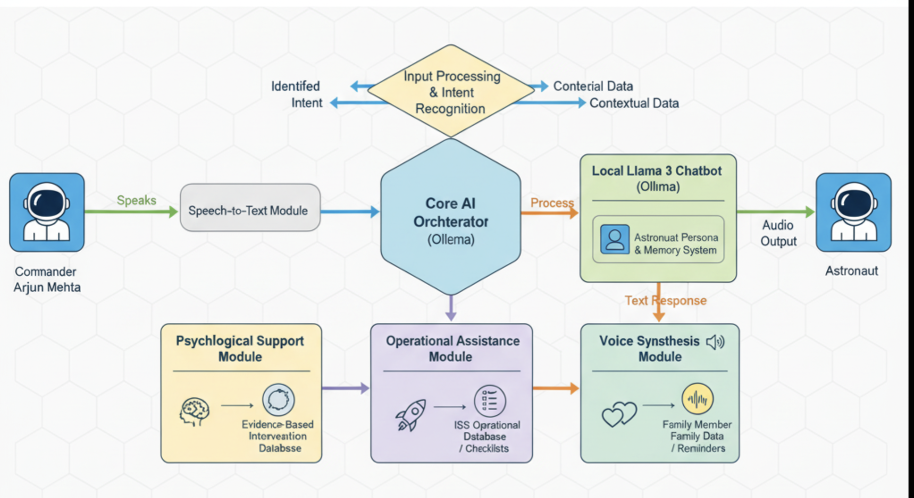

# Maitre -- Astronauts Pen Pal

<p align="center">
  
  <br/>
  <em>Drop your image at <code>assets/maitre-hero.png</code> or update the path above.</em>
  
</p>

A complete voice-to-voice AI psychological support system for astronauts on the International Space Station, featuring evidence-based interventions and operational assistance.

## Features

- **Psychological Support**: Evidence-based interventions for stress, isolation, and emotional well-being
- **Operational Assistance**: Situation-based guidance to aid ISS operations
- **Family Connection Support**: Help managing separation from loved ones
- **Offline Llama 3 Chatbot**: Local AI conversation using Ollama
- **Voice Synthesis**: Custom voice synthesis using macOS TTS with voice modifications
- **Astronaut Persona**: Personalized responses for Commander Arjun Mehta's ISS mission
- **Memory System**: Persistent conversation memory for continuity of care

## Quick Start

### Prerequisites
- macOS with Homebrew
- Python 3.9+
- Ollama installed

### Setup

1. **Install Ollama and pull model:**
```bash
# Install Ollama
brew install --cask ollama

# Start Ollama service
open -a "/Applications/Ollama.app"
ollama serve &

# Pull Llama 3.1 8B model
ollama pull llama3.1:8b

# For faster testing, use smaller model
ollama pull gemma3:1b
```

2. **Install Python dependencies:**
```bash
pip3 install pyttsx3 pydub
```

3. **Run the chatbot:**
```bash
# With voice output (family member voice)
USE_TTS=1 python3 chat.py

# With specific model
MODEL=gemma3:1b USE_TTS=1 python3 chat.py

# Text-only mode
USE_TTS=0 python3 chat.py
```

## Voice Customization

The system uses a family member voice by default. To customize:

1. **Edit voice settings in `voice_cloning.py`:**
```python
voice_options = [
    "Samantha",  # Clear, warm female voice
    "Karen",     # Australian accent, friendly  
    "Moira",     # Irish accent, warm
    "Tessa"      # South African accent, clear
]
```

2. **Adjust voice characteristics:**
```python
cloner.set_voice_characteristics(
    rate=150,        # Speech rate
    volume=0.9,      # Volume level
    pitch_shift=0,   # Pitch modification
    warmth_boost=True # Add warmth effects
)
```

## Current Mission Profile

The system is configured for Commander Arjun Mehta's ISS mission:

```json
{
  "astronaut_name": "Commander Arjun Mehta",
  "mission": {
    "vehicle": "International Space Station",
    "destination": "ISS",
    "duration_days": 180,
    "mission_type": "6-month ISS expedition"
  },
  "family": {
    "partner": "Maya",
    "daughters": {
      "ira": "7 years old",
      "sanvi": "5 years old"
    }
  },
  "support_focus": [
    "evidence-based psychological interventions",
    "situation-based operational guidance",
    "family connection support"
  ]
}
```

## Commands

- `/help` - Show available commands and support options
- `/mem` - List memories and previous interactions
- `/remember <note>` - Add important information to memory
- `/clear_mem` - Clear all memories
- `/exit` - Quit the chatbot

## Support Areas

- **Psychological Support**: Stress management, isolation coping, emotional regulation
- **Family Connection**: Managing separation from Ira and Sanvi, maintaining bonds
- **Operational Guidance**: Situation-based assistance for ISS operations
- **Physical Comfort**: Evidence-based strategies for physical discomforts
- **Sleep & Routine**: Support for maintaining healthy routines in space

## File Structure

```
hackthon/
├── chat.py                 # Main chatbot script
├── voice_cloning.py        # Voice synthesis system
├── persona/
│   └── astronaut.json     # Astronaut profile
├── storage/
│   └── memories.json      # Conversation memory
└── chat_history/          # Chat logs
```

## Environment Variables

- `USE_TTS=1` - Enable voice output (default: 1)
- `MODEL=llama3.1:8b` - Ollama model to use
- `OLLAMA_HOST=localhost` - Ollama server host
- `OLLAMA_PORT=11434` - Ollama server port

## Troubleshooting

**No voice output:**
- Check if `USE_TTS=1` is set
- Verify macOS TTS is working: `say "test"`
- Check voice permissions in System Preferences

**Model not responding:**
- Ensure Ollama is running: `ollama list`
- Try smaller model: `MODEL=gemma3:1b`
- Check Ollama service: `curl http://localhost:11434/api/version`

**Memory issues:**
- Check `storage/` directory permissions
- Verify JSON format in `memories.json`

## Advanced Voice Cloning

For more sophisticated voice cloning with Coqui TTS:

1. Install Coqui TTS (requires Python 3.10+):
```bash
pip install TTS
```

2. Use zero-shot voice cloning with reference audio:
```python
from TTS.api import TTS
tts = TTS(model_name="tts_models/multilingual/multi-dataset/xtts_v2")
tts.tts_to_file(
    text="Hello commander, how are you feeling today?",
    speaker_wav="path/to/reference/audio.wav",
    language="en",
    file_path="output.wav"
)
```

## License

MIT License - Feel free to modify and use for your projects.


